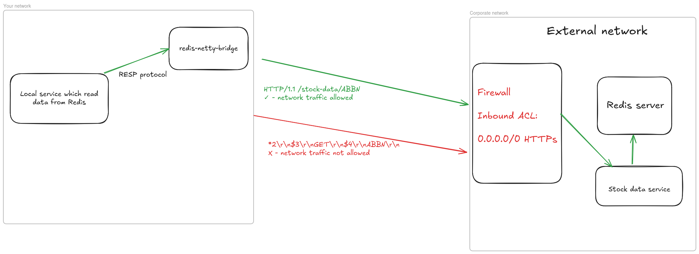
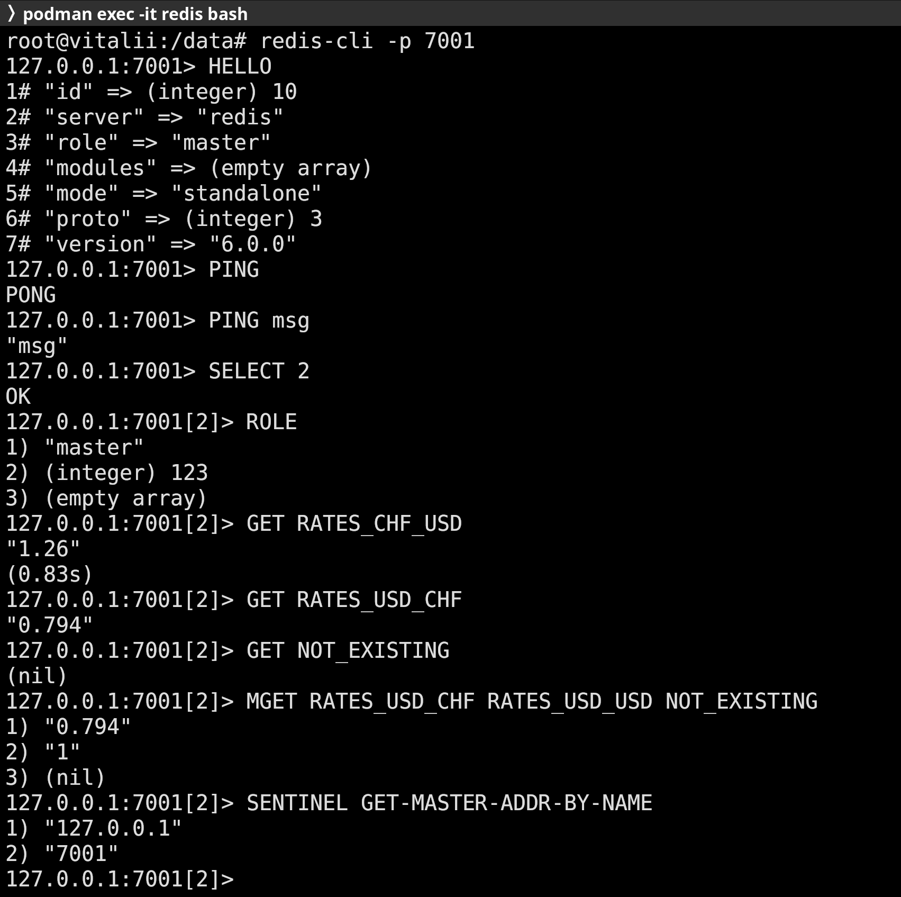

# redis-netty-bridge

redis-netty-bridge is a library used for building Redis proxies (servers that implement RESP protocol (protocol on top of which Redis is built) and delegate commands processing to external resources)

**Use case:**

**System consists of the following components:**
1. Redis cluster
2. Daemon that constantly updates stock data in Redis
3. HTTP Gateway microservice that provides stock data, stored in Redis, to clients
4. stock-data-consumer - microservice which need stock data for its business

_stock-data-consumer_ has very strict latency requirements, therefore fetching data through HTTP gateway is not an option because that would lead to higher latency.
stock-data-consumer reads stock data directly from Redis replica. Since development team doesn't have direct access to Redis, to test new version of stock-data-consumer locally, they need to start Redis locally, manually retrieve data for some products through gateway and populate local Redis with it, which takes significant amount of time.



**Potential solutions:**
1. Taking snapshot of Redis - doable if amount of data is not big, otherwise Redis would consume too many resources. In this particular case it's not feasible. Also, data will most likely be stale
2. Fetching data from HTTP Gateway if development profile is activated - requires code changes in app, potential duplication if many services need same data.
3. Creating Redis proxy that will delegate processing of commands to gateway - no code changes, no need to even start Redis/Redis-sentinel locally, Redis proxy consumes minimal amount of resources, data is fresh. 

Library significantly simplifies implementation of third approach. 
It implements:
1. Redis serialization protocol encoding / decoding with help of my other library (see https://github.com/vorobii-vitalii/resp-netty)
2. Redis handshake
3. Basic commands for Redis sentinel
4. Correct order of messages processing, therefore support for pipelining is there
5. Parsers for the most common commands
6. Command processing framework open for extension

**How to use the library?**

See full code in sample directory.

1. Implement integration with your resources
```java
public class GetRatesDataStrategy extends RegexGetDataStrategy {
    private static final Logger log = LoggerFactory.getLogger(GetRatesDataStrategy.class);
    
    private final HttpClient httpClient;
    private final Gson gson;

    public GetRatesDataStrategy() {
        super(Pattern.compile("^RATES_([A-Z]{3})_([A-Z]{3})$"));
    }

    @Override
    protected CompletableFuture<RespDataType> fetch(String key, String[] parsedArgs) {
        String fromCurrency = parsedArgs[0];
        String toCurrency = parsedArgs[1];

        HttpRequest fetchRatesRequest = HttpRequest.newBuilder()
                .version(HttpClient.Version.HTTP_2)
                .GET()
                .uri(URI.create("https://api.exchangerate-api.com/v4/latest/" + fromCurrency))
                .build();

        return httpClient.sendAsync(fetchRatesRequest, HttpResponse.BodyHandlers.ofString())
                .thenApply((Function<HttpResponse<String>, RespDataType>) response -> {
                    log.info("Http response from rates server: {}", response);
                    if (response.statusCode() == HttpResponseStatus.OK.code()) {
                        JsonObject jsonObject = gson.fromJson(response.body(), JsonObject.class);
                        return new RespBulkString(
                                jsonObject.getAsJsonObject("rates").get(toCurrency).getAsString()
                        );
                    } else {
                        log.warn("Error on fetch of rates {}", response.body());
                        return new RespNull();
                    }
                })
                .exceptionally(err -> {
                    log.info("Error on fetch of rates", err);
                    return new RespNull();
                });
    }
}
```
2. Start server with help of `io.vitaliivorobii.redis.netty.bridge.server.RedisNettyBridge`
```java
public class Main {

    public static final int PORT = 7000;

    public static void main(String[] args) throws InterruptedException {
        GetDataStrategy getDataStrategy = new FirstMatchGetDataStrategy(
                List.of(new GetRatesDataStrategy())
        );

        RedisCommandExecutor redisCommandExecutor = new CommandNameDelegatingCommandExecutor(Map.of(
                "HELLO", new HelloCommandExecutor(),
                "SELECT", new SelectCommandExecutor(),
                "PING", new PingCommandExecutor(),
                "ROLE", new RoleCommandExecutor(),
                "GET", new GetCommandExecutor(getDataStrategy),
                "MGET", new MGETCommandExecutor(getDataStrategy),
                "SENTINEL", new SentinelCommandExecutor(List.of(
                        new GetMasterAddressSentinelCommandExecutionStrategy()
                ))
        ));
        RedisNettyBridge redisNettyBridge = new RedisNettyBridge(PORT, redisCommandExecutor);
        redisNettyBridge.start().await().sync();
    }
}
```
3. Test
